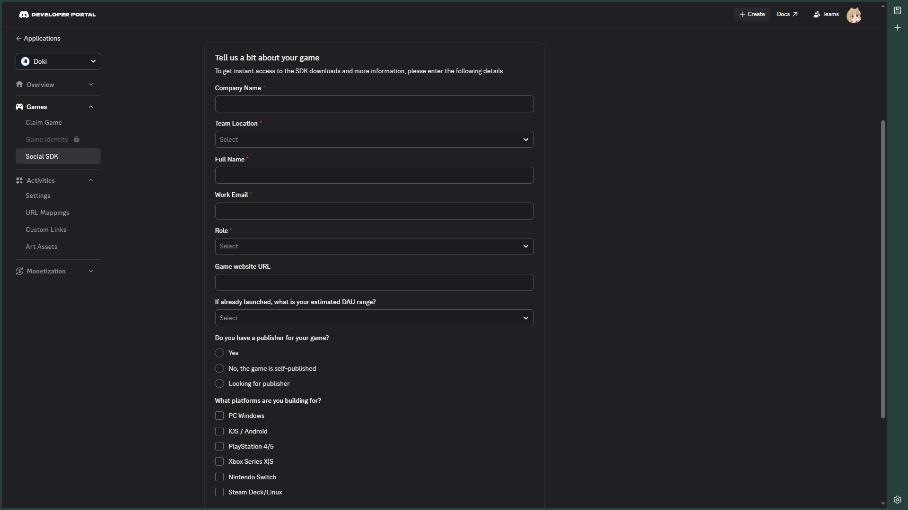

# OAuth2 RPC (Kotlin)

This project is a Proof of Concept (PoC) that implements a small portion of the **Discord OAuth2** flow and **Rich Presence** updates via the Discord Gateway WebSocket.

[](https://jitpack.io/#UsagiApp/OAuth2-RPC) 

## Usage

1. Add it to your root `build.gradle` at the end of repositories:

   ```groovy
   allprojects {
       repositories {
           ...
           maven { url 'https://jitpack.io' }
       }
   }
   ```

2. Add the dependency (in your Java / Kotlin / Android project)

    ```groovy
    dependencies {
       implementation("com.github.UsagiApp:OAuth2-RPC:$version")
    }
    ```

    Versions are available on [JitPack](https://jitpack.io/#UsagiApp/OAuth2-RPC)

    When used in Android
    projects, [core library desugaring](https://developer.android.com/studio/write/java8-support#library-desugaring) with
    the [NIO specification](https://developer.android.com/studio/write/java11-nio-support-table) should be enabled to support Java 8+ features.

## Project structure

The core library (in `library/src/main/kotlin/com/discord/oauth2rpc/`) provides:

| Component | Description |
|---|---|
| `Gateway.kt` | Discord Gateway WebSocket client (Ktor + coroutines) |
| `Rest.kt` | REST API client with dynamic route builder |
| `Interface.kt` | `TokenResponse`, `GatewayPacket`, `ReadyEvent`, etc. |
| `structures/Presence.kt` | `RichPresence`, `CustomStatus`, `SpotifyRPC` builders |
| `utils/` | `BitField`, `Intents`, `GatewayCapabilities`, `ActivityFlags`, `Constants`, `Util` |

### Dependencies
- `ktor-client-okhttp` + `ktor-client-websockets` — HTTP & WebSocket
- `kotlinx-serialization-json` — JSON parsing
- `kotlinx-coroutines` — async concurrency

## Setup

### Prerequisites
- JDK 17+
- Gradle (or use the included wrapper)

### Step 1: Create an Application
Go to the [Discord Developer Portal](https://discord.com/developers/applications) and create a new Application.

### Step 2: Unlock the Social SDK Feature
Fill out the Social SDK registration form (**Games** > **Social SDK**) to unlock this feature for your Application.



### Step 3: Configure OAuth2
- Go to the newly created Application > Select the **OAuth2** tab.
- Enable the **"Public Client"** setting.
- Add your **Redirects URL** to the list (`usagi://discord-auth` **OR** `kotatsu://discord-auth`), depends on your application.

> [!NOTE]
> The bearer token remains valid for up to 7 days. You can use the refresh flow to renew its expiration and continue using the token.

## Credits

- The images used in this README are sourced from @chirina's Discord Widget tutorial.
- Original TS implementation by [Elysia](https://github.com/aiko-chan-ai), rewritten by [Hà Tiến Sáng](https://github.com/sang765) and modified by [Draken](https://github.com/dragonx943).
